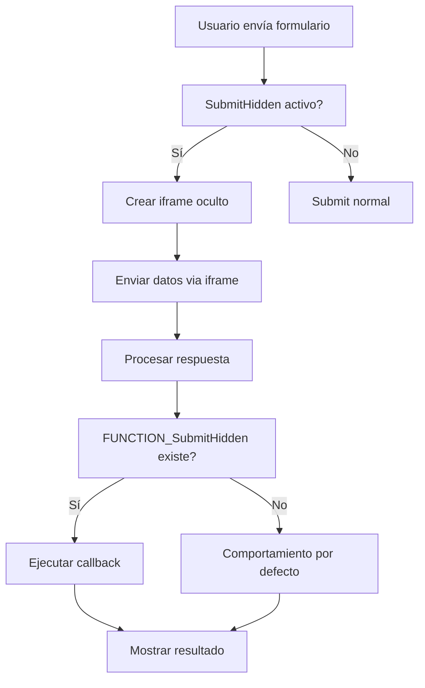

# SubmitHidden

## Sintaxis

```
[SubmitHidden] Mode
```

## Descripción

Ejecuta el submit del formulario utilizando un iframe oculto en modos específicos. Esta funcionalidad permite enviar datos sin recargar la página principal, proporcionando una experiencia de usuario más fluida.

Si existe la función `FUNCTION_SubmitHidden`, la ejecutará automáticamente pasando dos parámetros:
1. **Resultado de la operación** (true/false)
2. **Mensaje a mostrar**

## Parámetros

| Parámetro | Descripción | Ejemplo |
|-----------|-------------|---------|
| `Mode` | Modo de funcionamiento del formulario | `a`, `mR`, `bR`, `cR` |

## Modos Compatibles

| Modo | Descripción | Uso Típico |
|------|-------------|------------|
| `a` | Modo agregar | Inserción de nuevos registros |
| `mR` | Modo modificar con retorno | Edición con regreso automático |
| `bR` | Modo búsqueda con retorno | Búsqueda con regreso automático |
| `cR` | Modo consulta con retorno | Consulta con regreso automático |

## Función de Callback

### Definición de la Función
```javascript
function FUNCTION_SubmitHidden(operacionExitosa, mensajeRespuesta) {
    if (operacionExitosa) {
        // Lógica para operación exitosa
        console.log("Éxito: " + mensajeRespuesta);
    } else {
        // Lógica para operación fallida
        console.log("Error: " + mensajeRespuesta);
    }
}
```

### Parámetros de Callback

| Parámetro | Tipo | Descripción |
|-----------|------|-------------|
| `operacionExitosa` | Boolean | `true` si la operación fue correcta, `false` si falló |
| `mensajeRespuesta` | String | Mensaje descriptivo del resultado de la operación |

## Ejemplos Prácticos

### Ejemplo 1: Configuración Básica
```
[SubmitHidden] a
```
**Uso**: Formulario de inserción con submit oculto.

### Ejemplo 2: Con Función de Callback
```html
[SubmitHidden] mR

<script>
function FUNCTION_SubmitHidden(success, message) {
    if (success) {
        alert("Registro modificado correctamente: " + message);
        // Actualizar interfaz o redirigir
        location.reload();
    } else {
        alert("Error al modificar: " + message);
        // Mostrar errores específicos
    }
}
</script>
```

### Ejemplo 3: Manejo Avanzado de Respuestas
```javascript
function FUNCTION_SubmitHidden(operacionExitosa, mensajeRespuesta) {
    const notification = document.getElementById('notification');
    
    if (operacionExitosa) {
        notification.className = 'alert alert-success';
        notification.innerHTML = '<strong>Éxito:</strong> ' + mensajeRespuesta;
        
        // Limpiar formulario después de 2 segundos
        setTimeout(() => {
            document.getElementById('miFormulario').reset();
            notification.style.display = 'none';
        }, 2000);
        
    } else {
        notification.className = 'alert alert-danger';
        notification.innerHTML = '<strong>Error:</strong> ' + mensajeRespuesta;
    }
    
    notification.style.display = 'block';
}
```

### Ejemplo 4: Integración con AJAX
```javascript
function FUNCTION_SubmitHidden(success, message) {
    // Actualizar datos en tiempo real
    if (success) {
        // Recargar datos específicos sin recargar página
        updateDataTable();
        showSuccessMessage(message);
    } else {
        showErrorMessage(message);
        highlightErrorFields();
    }
}

function updateDataTable() {
    // Lógica para actualizar tabla de datos
    fetch('/api/data/refresh')
        .then(response => response.json())
        .then(data => {
            // Actualizar tabla
        });
}
```

## Casos de Uso

### 1. Formularios de Inserción Rápida
```
[SubmitHidden] a
```
Para insertar registros sin recargar la página.

### 2. Edición en Línea
```
[SubmitHidden] mR
```
Para modificar registros con retroalimentación inmediata.

### 3. Búsquedas Dinámicas
```
[SubmitHidden] bR
```
Para realizar búsquedas sin perder el contexto de la página.

### 4. Consultas Interactivas
```
[SubmitHidden] cR
```
Para consultas que requieren respuesta inmediata.

## Ventajas del Submit Oculto

### ✅ **Beneficios**
- **Experiencia de Usuario**: No recarga la página completa
- **Rapidez**: Respuesta más rápida al usuario
- **Contexto**: Mantiene el estado de la interfaz
- **Flexibilidad**: Permite manejo personalizado de respuestas

### ⚠️ **Consideraciones**
- **JavaScript**: Requiere que JavaScript esté habilitado
- **Compatibilidad**: Funciona con navegadores modernos
- **Debugging**: Puede ser más difícil depurar errores

## Flujo de Funcionamiento



## Notas Importantes

- ✅ **Modos específicos**: Solo funciona en modos `a`, `mR`, `bR`, `cR`
- ✅ **Función opcional**: `FUNCTION_SubmitHidden` es opcional pero recomendada
- ✅ **Asíncrono**: El proceso es asíncrono, no bloquea la interfaz
- ⚠️ **Iframe oculto**: Utiliza tecnología iframe para el envío
- ⚠️ **Validación**: Mantiene todas las validaciones del formulario original

## Ejemplo Completo

```html
<!-- Configuración del formulario -->
[SubmitHidden] a

<!-- Definición de campos -->
[Fields]
    Nombre    | nombre    | 1 | T | 50 || M |||
    Email     | email     | 1 | T | 50 || M |||
    Teléfono  | telefono  | 0 | T | 20 || M |||

<!-- Script de manejo -->
<script>
function FUNCTION_SubmitHidden(success, message) {
    const statusDiv = document.getElementById('status');
    
    if (success) {
        statusDiv.innerHTML = `
            <div class="alert alert-success">
                <strong>¡Éxito!</strong> ${message}
            </div>
        `;
        // Limpiar formulario
        document.forms[0].reset();
    } else {
        statusDiv.innerHTML = `
            <div class="alert alert-danger">
                <strong>Error:</strong> ${message}
            </div>
        `;
    }
}
</script>

<!-- Área de estado -->
<div id="status"></div>
```

Esta configuración permite un formulario de inserción que no recarga la página y proporciona retroalimentación inmediata al usuario.