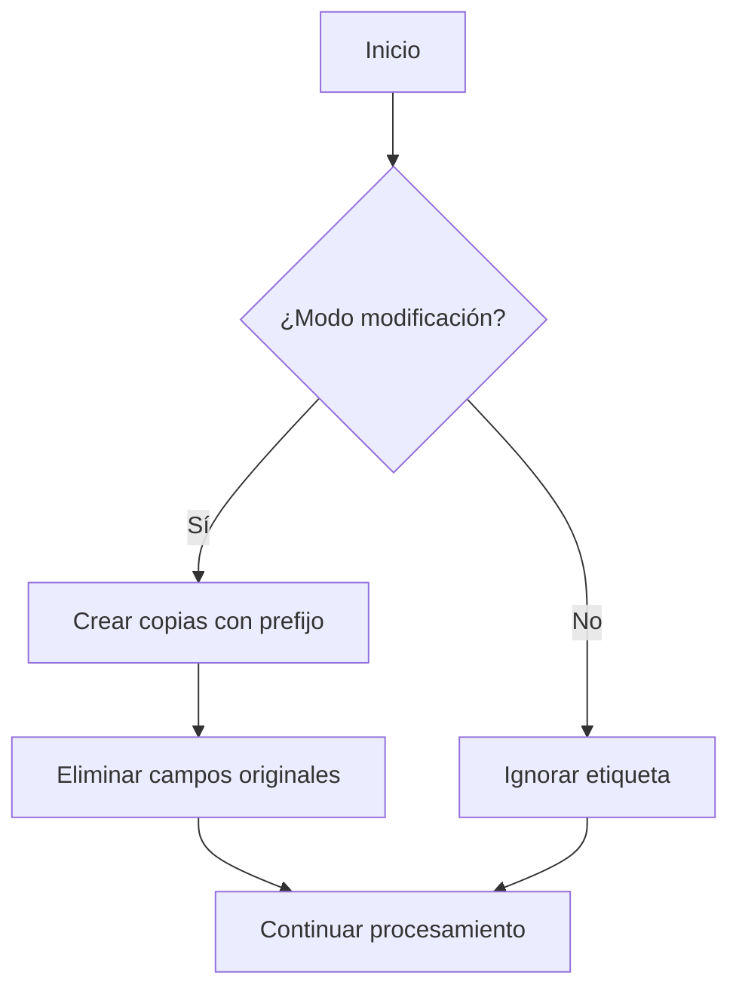

# Unset

## Descripción General

La etiqueta `Unset` permite eliminar campos específicos del array POST, con la opción de crear copias de respaldo con un prefijo personalizado. Esta funcionalidad es especialmente útil para la gestión dinámica de datos en formularios y procesos de modificación.

## Sintaxis

```
[Unset] ListFields | PrefijoNewPost
```

### Parámetros

- **ListFields**: Lista de campos a eliminar del POST, separados por comas
- **PrefijoNewPost**: Prefijo para crear nuevos campos de respaldo

## Funcionamiento

### Modo de Operación

⚠️ **Importante**: Esta etiqueta **solo está activa en el modo de modificación**.

### Comportamiento del Prefijo

- Si `PrefijoNewPost` **no empieza por "_"**: El sistema añadirá automáticamente el prefijo
- Si `PrefijoNewPost` **empieza por "_"**: Se utilizará el prefijo tal como se especifica

## Proceso de Ejecución

### 1. Creación de Copias de Respaldo

Antes de eliminar los campos, el sistema crea copias con el prefijo especificado:

```php
// Ejemplo conceptual
foreach($listFields as $field) {
    $_POST[$prefijoNewPost . $field] = $_POST[$field];
}
```

### 2. Eliminación de Campos Originales

Posteriormente, elimina los campos originales del array POST:

```php
// Ejemplo conceptual
foreach($listFields as $field) {
    unset($_POST[$field]);
}
```

## Ejemplos de Uso

### Ejemplo Básico

```
[Unset] nombre,email,telefono | bkp_
```

**Resultado**:
- Elimina: `$_POST['nombre']`, `$_POST['email']`, `$_POST['telefono']`
- Crea: `$_POST['bkp_nombre']`, `$_POST['bkp_email']`, `$_POST['bkp_telefono']`

### Ejemplo con Prefijo Personalizado

```
[Unset] usuario,password | _original
```

**Resultado**:
- Elimina: `$_POST['usuario']`, `$_POST['password']`
- Crea: `$_POST['_originalusuario']`, `$_POST['_originalpassword']`

### Ejemplo sin Prefijo de Respaldo

```
[Unset] campo_temporal,cache_data | 
```

**Resultado**:
- Elimina: `$_POST['campo_temporal']`, `$_POST['cache_data']`
- No crea copias de respaldo

## Casos de Uso

### 1. Limpieza de Formularios

```
[Unset] csrf_token,submit_button | temp_
```

Elimina campos técnicos pero mantiene una copia temporal para auditoría.

### 2. Versionado de Datos

```
[Unset] datos_sensibles | version_anterior_
```

Preserva una versión anterior de los datos antes de procesarlos.

### 3. Filtrado Dinámico

```
[Unset] campo1,campo2,campo3 | filtrado_
```

Separa campos específicos para procesamiento especializado.

## Consideraciones Técnicas

### Requisitos

- **Modo de modificación activo**: La etiqueta no funciona en otros modos
- **Campos existentes**: Los campos especificados deben existir en `$_POST`
- **Gestión de memoria**: Considere el impacto de duplicar datos grandes

### Limitaciones

- Solo funciona en modo de modificación
- No valida la existencia de campos antes de procesarlos
- El prefijo se aplica de forma literal

### Mejores Prácticas

1. **Validación previa**: Verifique que los campos existen antes de usar Unset
2. **Nomenclatura clara**: Use prefijos descriptivos para las copias
3. **Documentación**: Registre qué campos se eliminan y por qué
4. **Limpieza posterior**: Elimine copias de respaldo cuando ya no sean necesarias

## Flujo de Procesamiento



## Notas de Seguridad

- **Datos sensibles**: Tenga cuidado al crear copias de campos con información sensible
- **Persistencia**: Las copias permanecen en memoria durante la ejecución del script
- **Auditoría**: Use esta funcionalidad para mantener trazas de modificaciones

---

*Esta documentación describe el sistema Unset para la gestión dinámica de campos POST en aplicaciones web.*